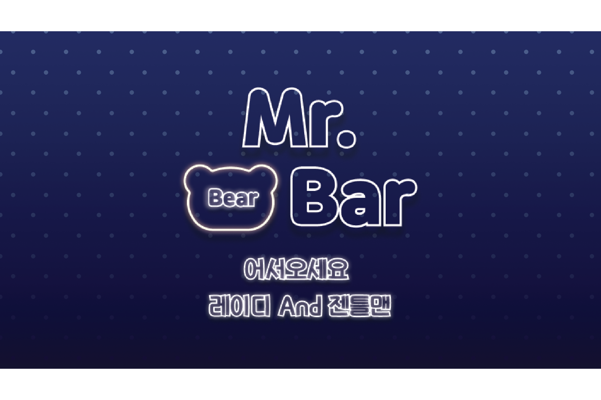

# 프로젝트 이름

   
  
   

## 프로젝트 소개
이용자의 상황 및 성격에 적합한 주류를 추천해주는 기능을 가진 온라인 편지 서비스

- 두 단계의 선택지 기반으로 이용자의 상황에 최적화된 주류를 추천합니다.
- 바(bar) 형태로 된 귀여운 디자인 환경에서 받은 편지의 감상이 가능합니다.
- 계정이 없는 사람도 편하게 편지를 전송할 수 있습니다.

개발 기간: 2023.04.01~2023.09.31

### 팀원

|[bezkwag](https://github.com/bezkwag)|[chanheek](https://github.com/chanheek)|[Winter-gr](https://github.com/Winter-gr)|김수아|..|
|------|---|---|---|---|
|PM|프론트엔드|백엔드|디자인|디자인|

 

## 1. 기술 스택

| TypeScript |   React   |  firebase    |  styled component  |
| :--------: | :-------: | :------:     | :----------------: |
|   ![ts]    |  ![react] | ![firebase]  |      ![styled]     |

 

## 2. 프로젝트 내용

### 2-1. 주류 추천 알고리즘

1. **데이터**: https://github.com/bearwithbottle/data/blob/main/metadata.csv
   
주변에서 쉽게 구할 수 있는 데이터를 활용해서 총 64개의 주류 데이터를 수집하고 주류 판매 홈페이지에 묘사되어 있는 내용을 중심으로 키워드를 부여했습니다. 

2. **데이터 분류**:

키워드를 중심으로 8가지 해시태그로 두 단계에 나눠서 주류를 분류했습니다.

3. **군집분석**: https://github.com/bezkwag/sideproject/blob/main/%E1%84%80%E1%85%AE%E1%86%AB%E1%84%8C%E1%85%B5%E1%86%B8%E1%84%87%E1%85%AE%E1%86%AB%E1%84%89%E1%85%A5%E1%86%A8.ipynb

- 활용 변수: 주류의 도수, 가격, 원산지(순서에 따라서 라벨링) 등
- PCA 활용: 시각적으로 주류의 유사성을 확인하고, 계층적 군집분석에 연동해서 활용하기 위함
- 계층적 군집분석 활용: 주류 간의 유사성을 상대적으로 파악하기 위함

  (계산 방법: average linkage)

### 2-2. 페이지 설명

1. **주류를 선물하는 유저의 유저플로우**

- 주류는 세 가지 추천 주류 라인업 중에서 선택할 수 있도록 했습니다.
- 유저가 재미를 느낄 수 있는 친근한 UX 라이팅 선정에 유의했습니다.
- 편지를 보낸 후에는 보낸 이도 바로 계정을 만들어볼 수 있도록 유도했습니다.
 

2. **주류를 받는 유저의 유저 플로우**

- '냉장고' 기능과 '바' 기능을 통해서 두 가지 방법으로 받은 주류에 접근할 수 있도록 했습니다.
- 자신의 바를 쉽게 공유하고 편지를 추가로 받을 수 있도록 했습니다.
- 편지를 읽을 수 있는 공간을 최대한 확보하여 편지의 내용을 쉽게 열람할 수 있도록 했습니다. 또한, 편지의 내용은 바의 주인만 열람이 가능하도록 설정했습니다.
 

3. **가입 과정**

- 구글과 깃허브, 두 가지 경로로 쉽게 가입이 가능하도록 연동했습니다.
- 주류를 추천하는 서비스이다보니 미성년자의 가입을 일차적으로 예방하고자 했습니다.
- 메인 페이지의 이미지를 커스텀할 수 있도록 하여 고객의 개인화 경험을 강화했습니다.
- 로딩창에도 영상 이미지를 활용해서 짧은 시간동안 고객 경험을 강화했습니다.

### 2-3. 구현 기술

### 2-4. 디자인 컨셉

- 집에서 흔히 볼 수 있는 '곰인형'을 활용하여 일상적이고 친숙한 이미지를 만들고자 했습니다.
- 컨셉 키워드는 바텐더, 네온조명 등 입니다. 집에서 혼술을 즐기는 2030 세대를 위해 편안한 집의 이미지와 우아한 바의 이미지를 적절하게 섞어서 활용했습니다. 

<!-- Stack Icon Refernces -->

[ts]: client/src/assets/stack/type.png
[react]: client/src/assets/stack/react.png
[firebase]: client/src/assets/stack/firebaes.png
[styled]: client/src/assets/stack/styled.png
